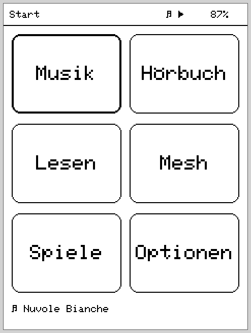
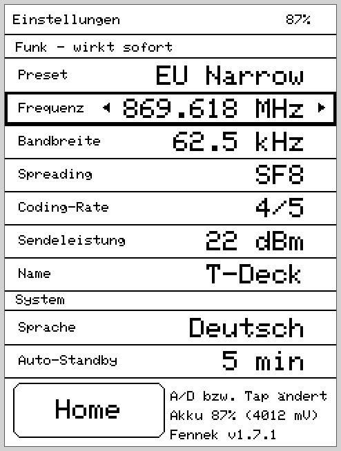

<div align="center">

# 🦊 Fennek

**Eine alternative Open-Source-Firmware für das LilyGO T-Deck Pro**

Musik, Hörbücher, eBooks und LoRa-Mesh-Chat — in einem Handheld.

[🇬🇧 English](README.md) · 🇩🇪 Deutsch · [🇸🇪 Svenska](README.sv.md)

[](LICENSE)
[](https://github.com/danst0/fennek/releases/latest)
[](https://github.com/danst0/fennek/releases)
[](CHANGELOG.md)
[](https://www.espressif.com/en/products/socs/esp32-s3)
[](https://www.lilygo.cc/products/t-deck-pro)
[](https://platformio.org/)

</div>

---

**Fennek** macht aus dem LilyGO T-Deck Pro (ESP32-S3, E-Ink, LoRa) ein echtes
Handheld: Musik hören, Hörbücher fortsetzen, eBooks lesen und über **MeshCore**
im LoRa-Mesh chatten — mit Homescreen-Launcher, Touch + physischer Tastatur und
Hintergrund-Audio über App-Grenzen hinweg. Wie der Wüstenfuchs: klein,
genügsam, große Ohren.

Es ist eine **eigenständige Alternative** zur ab Werk gelieferten Firmware —
gebaut um die zentrale Eigenheit der Hardware herum, dass E-Ink, SD-Karte und
LoRa sich **einen** SPI-Bus teilen, und trotzdem stotterfreie Audio-Wiedergabe
liefert.

## 📸 Screenshots

<table>
  <tr>
    <td align="center"><br><sub>Launcher (App-Auswahl)</sub></td>
    <td align="center"><br><sub>Musik – Wiedergabe</sub></td>
  </tr>
  <tr>
    <td align="center"><br><sub>Spiele – Tic-Tac-Toe</sub></td>
    <td align="center"><br><sub>Einstellungen (Funk &amp; System)</sub></td>
  </tr>
  <tr>
    <td align="center"><br><sub>Standby (schlafender Fennek)</sub></td>
    <td></td>
  </tr>
</table>

<sub>Pixelgenau aus dem echten Zeichencode gerendert (240×320 E-Ink) via
<code>tools/screenshots.sh</code> — siehe <a href="tools/README.md">tools/</a>.</sub>

## ✨ Apps

| App | Funktionen |
|---|---|
| **🎵 Musik** | MP3/AAC/FLAC/WAV von SD (`/music`), Künstler/Album/Playlist-Browser, ID3-Tags (mit SD-Cache), Shuffle/Repeat, Sleep-Timer, Resume nach Reboot |
| **🎧 Hörbuch** | Bücher als Ordner unter `/audiobooks`, Kapitel natural-sortiert, Bookmark pro Buch (NVS), ±30 s-Sprünge, Sleep-Timer |
| **📖 Lesen** | `.txt` und `.epub` aus `/books`, EPUB-Konvertierung on-device (ROM-tinfl), Seiten-Index-Cache, Leseposition pro Buch |
| **📡 Mesh** | Schlanker MeshCore-Client: Public- und Hashtag-Kanäle (`#test` …), DMs mit Zustellstatus, Kontakte aus Adverts, Nachrichten-Log auf SD inkl. Verlauf-Reload |
| **🎮 Spiele** | 2048, Minensucher, Schach (Negamax-KI) und Tic-Tac-Toe — Logik host-getestet |
| **⚙️ Optionen** | Funk-Presets (EU Narrow = DE/NRW-Standard 869,618 MHz/62,5 kHz/SF8), Einzelparameter, Node-Name, Akku-Info, Firmware-Version |

Dazu: Statuszeile (Akku, Wiedergabe), Standby/Tastensperre per Knopf, und eine
Serial-Debug-Konsole über USB (`help` eingeben — `status`, `chan test Hallo`,
`meshlog`, `ls /books` …).

## 🔧 Hardware

LilyGO **T-Deck Pro V1.1**: ESP32-S3 (16 MB Flash, 8 MB PSRAM), E-Ink
GDEQ031T10 240×320, CST328-Touch (I2C), TCA8418-Tastatur, PCM5102A-DAC
(I2S, 3,5-mm-Klinke), SX1262-LoRa, BQ27220-Fuel-Gauge, microSD.

> **Zentrale Eigenheit:** E-Ink, SD-Karte und LoRa teilen sich **einen**
> SPI-Bus. Die ganze Architektur dreht sich darum, dass Audio trotzdem nie
> stottert und Eingaben sofort reagieren — Details in [`CLAUDE.md`](CLAUDE.md)
> (Anti-Stotter-Invarianten).

## 🚀 Bauen & Flashen

Voraussetzung: [PlatformIO](https://platformio.org/). T-Deck Pro per USB-C
anschließen, dann:

```bash
pio run -e fennek              # bauen
pio run -e fennek -t upload    # flashen (USB-C)
pio device monitor -b 115200   # Log + Debug-Konsole
```

Die Firmware läuft auch **ohne SD-Karte** (Apps zeigen dann einen Hinweis).
Funkparameter sind zur Laufzeit in der Optionen-App einstellbar; Default ist
das in Deutschland übliche **EU/UK-Narrow**-Preset.

> ⚠️ Eigene Firmware ersetzt die Werks-Software. Du flashst auf eigene
> Verantwortung — ein Rückweg zur Original-Firmware ist über die
> [LilyGO-Ressourcen](https://github.com/Xinyuan-LilyGO) möglich.

## 📁 Projekt-Layout

- `src/` — aktive Firmware (`core/` Treiber & Framework, `services/` Audio/
  Bibliothek/Text, `apps/` die Apps)
- `lib/meshcore/`, `lib/ed25519/` — vendored MeshCore-Stack (Subset)
- `boards/t-deck_pro.json` — Board-Definition (Partition `default_16MB.csv`)
- `CHANGELOG.md` — Release-Notes
- `CLAUDE.md` — Architektur, Invarianten, Verifikationsstand
- `LICENSE` — GPL-3.0-or-later

## 📜 Lizenz

Fennek steht unter der **GNU General Public License v3.0 oder später
(GPL-3.0-or-later)** — siehe [`LICENSE`](LICENSE).

Mitgelieferte Komponenten behalten ihre eigene, GPL-kompatible Lizenz:

- **MeshCore** (`lib/meshcore/`) — MIT License, © Scott Powell / rippleradios.com
  ([Original](https://github.com/ripplebiz/MeshCore), [`lib/meshcore/LICENSE`](lib/meshcore/LICENSE))
- **ed25519** (`lib/ed25519/`) — zlib License, © Orson Peters
  ([`lib/ed25519/license.txt`](lib/ed25519/license.txt))

## 🙏 Credits

Fennek entstand in Anlehnung an den **Meck**-Fork
([pelgraine/Meck](https://github.com/pelgraine/Meck), MeshCore-Companion für das
T-Deck), wurde aber ab v1.0.0 als eigenständige Multi-App-Firmware neu aufgebaut
und ist seither ein eigenes Projekt. Der Mesh-Stack basiert auf
[MeshCore](https://github.com/ripplebiz/MeshCore) von Scott Powell. Der frühere
Meck-Code (vormals unter `archive_legacy/`) liegt in der Git-Historie und ist
von dort jederzeit wiederherstellbar.
