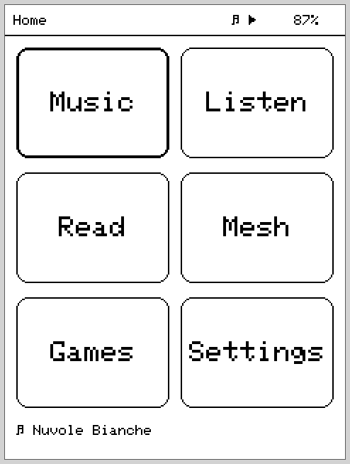
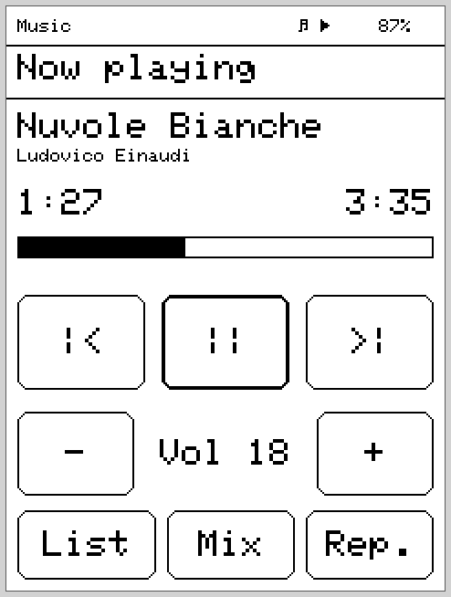
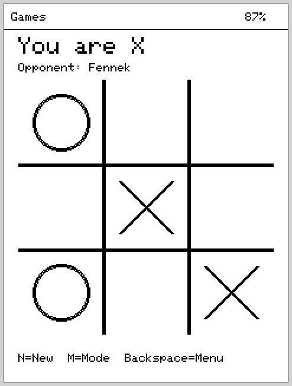
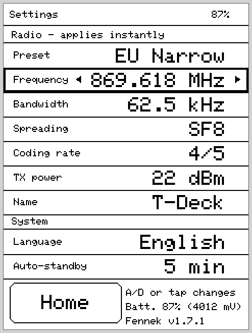

<div align="center">

# 🦊 Fennek

**An alternative open-source firmware for the LilyGO T-Deck Pro**

Music, audiobooks, eBooks and LoRa mesh chat — in one handheld.

🇬🇧 English · [🇩🇪 Deutsch](README.de.md) · [🇸🇪 Svenska](README.sv.md)

[](LICENSE)
[](https://github.com/danst0/fennek/releases/latest)
[](https://github.com/danst0/fennek/releases)
[](CHANGELOG.md)
[](https://www.espressif.com/en/products/socs/esp32-s3)
[](https://www.lilygo.cc/products/t-deck-pro)
[](https://platformio.org/)

</div>

---

**Fennek** turns the LilyGO T-Deck Pro (ESP32-S3, E-Ink, LoRa) into a real
handheld: listen to music, resume audiobooks, read eBooks and chat over the LoRa
mesh via **MeshCore** — with a homescreen launcher, touch + physical keyboard,
and background audio that keeps playing across app switches. Like the desert
fox: small, frugal, big ears.

It is a **standalone alternative** to the factory firmware — built around the
hardware's defining quirk, that E-Ink, the SD card and LoRa all share **one**
SPI bus, while still delivering stutter-free audio playback.

## 📸 Screenshots

<table>
  <tr>
    <td align="center"><br><sub>Launcher (app picker)</sub></td>
    <td align="center"><br><sub>Music – playback</sub></td>
  </tr>
  <tr>
    <td align="center"><br><sub>Games – Tic-Tac-Toe</sub></td>
    <td align="center"><br><sub>Settings (radio &amp; system)</sub></td>
  </tr>
  <tr>
    <td align="center"><br><sub>Standby (sleeping fennec)</sub></td>
    <td></td>
  </tr>
</table>

<sub>Rendered pixel-accurately from the real drawing code (240×320 E-Ink) via
<code>tools/screenshots.sh</code> — see <a href="tools/README.md">tools/</a>.</sub>

## ✨ Apps

| App | Features |
|---|---|
| **🎵 Music** | MP3/AAC/FLAC/WAV from SD (`/music`), artist/album/playlist browser, ID3 tags (with SD cache), shuffle/repeat, sleep timer, resume after reboot |
| **🎧 Audiobook** | Books as folders under `/audiobooks`, chapters natural-sorted, per-book bookmark (NVS), ±30 s jumps, sleep timer |
| **📖 Reading** | `.txt` and `.epub` from `/books`, on-device EPUB conversion (ROM-tinfl), page-index cache, per-book reading position |
| **📡 Mesh** | Lean MeshCore client: public and hashtag channels (`#test` …), DMs with delivery status, contacts from adverts, message log on SD incl. history reload |
| **🎮 Games** | 2048, Minesweeper, Chess (Negamax AI) and Tic-Tac-Toe — logic host-tested |
| **⚙️ Options** | Radio presets (EU Narrow = DE/NRW standard 869.618 MHz / 62.5 kHz / SF8), individual parameters, node name, battery info, firmware version |

Plus: a status line (battery, playback), standby/key-lock via the button, and a
serial debug console over USB (type `help` — `status`, `chan test hello`,
`meshlog`, `ls /books` …).

## 🔧 Hardware

LilyGO **T-Deck Pro V1.1**: ESP32-S3 (16 MB flash, 8 MB PSRAM), E-Ink
GDEQ031T10 240×320, CST328 touch (I2C), TCA8418 keyboard, PCM5102A DAC
(I2S, 3.5 mm jack), SX1262 LoRa, BQ27220 fuel gauge, microSD.

> **Defining quirk:** E-Ink, the SD card and LoRa share **one** SPI bus. The
> entire architecture revolves around audio never stuttering despite that, and
> inputs responding instantly — details in [`CLAUDE.md`](CLAUDE.md)
> (anti-stutter invariants).

## 🚀 Build & Flash

Prerequisite: [PlatformIO](https://platformio.org/). Connect the T-Deck Pro via
USB-C, then:

```bash
pio run -e fennek              # build
pio run -e fennek -t upload    # flash (USB-C)
pio device monitor -b 115200   # log + debug console
```

The firmware also runs **without an SD card** (apps then show a hint). Radio
parameters are configurable at runtime in the Options app; the default is the
**EU/UK Narrow** preset commonly used in Germany.

> ⚠️ Custom firmware replaces the factory software. You flash at your own risk —
> a way back to the original firmware is available via the
> [LilyGO resources](https://github.com/Xinyuan-LilyGO).

## 📁 Project layout

- `src/` — active firmware (`core/` drivers & framework, `services/` audio/
  library/text, `apps/` the apps)
- `lib/meshcore/`, `lib/ed25519/` — vendored MeshCore stack (subset)
- `boards/t-deck_pro.json` — board definition (partition `default_16MB.csv`)
- `CHANGELOG.md` — release notes
- `CLAUDE.md` — architecture, invariants, verification status
- `LICENSE` — GPL-3.0-or-later

## 📜 License

Fennek is licensed under the **GNU General Public License v3.0 or later
(GPL-3.0-or-later)** — see [`LICENSE`](LICENSE).

Bundled components keep their own GPL-compatible licenses:

- **MeshCore** (`lib/meshcore/`) — MIT License, © Scott Powell / rippleradios.com
  ([original](https://github.com/ripplebiz/MeshCore), [`lib/meshcore/LICENSE`](lib/meshcore/LICENSE))
- **ed25519** (`lib/ed25519/`) — zlib License, © Orson Peters
  ([`lib/ed25519/license.txt`](lib/ed25519/license.txt))

## 🙏 Credits

Fennek started out inspired by the **Meck** fork
([pelgraine/Meck](https://github.com/pelgraine/Meck), a MeshCore companion for
the T-Deck), but was rebuilt from v1.0.0 as a standalone multi-app firmware and
has been its own project ever since. The mesh stack is based on
[MeshCore](https://github.com/ripplebiz/MeshCore) by Scott Powell. The earlier
Meck code (formerly under `archive_legacy/`) lives in the Git history and can be
restored from there at any time.
