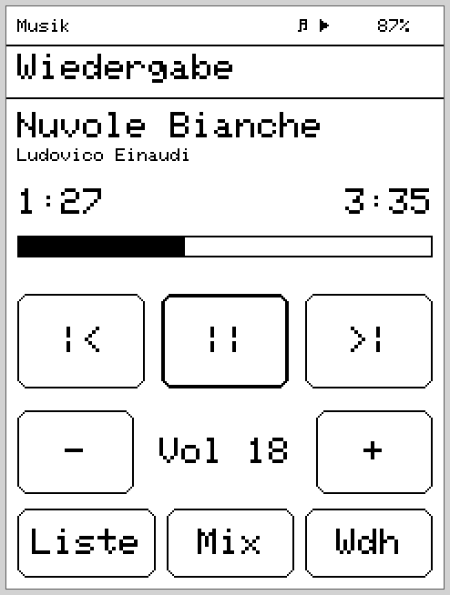
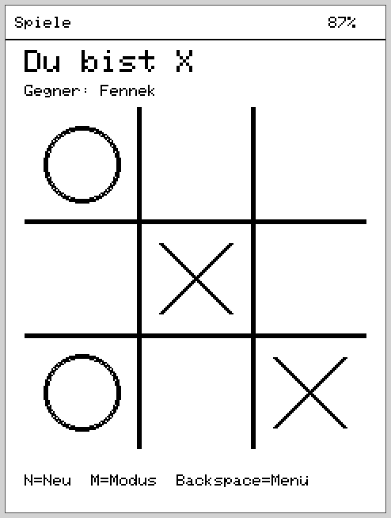
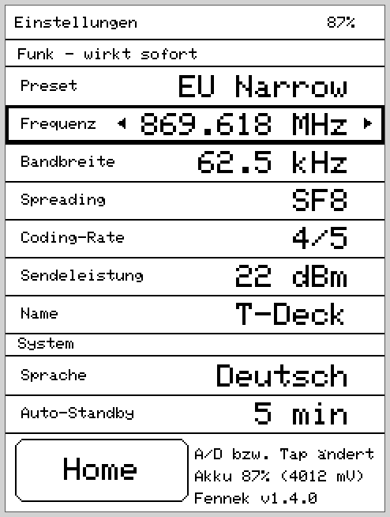
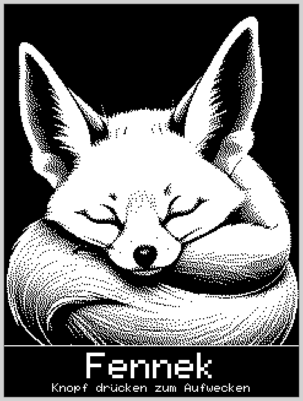

<div align="center">

# 🦊 Fennek

**En alternativ öppen källkods-firmware för LilyGO T-Deck Pro**

Musik, ljudböcker, e-böcker och LoRa-mesh-chatt — i en handenhet.

[🇬🇧 English](README.md) · [🇩🇪 Deutsch](README.de.md) · 🇸🇪 Svenska

[](LICENSE)
[](https://github.com/danst0/fennek/releases/latest)
[](https://github.com/danst0/fennek/releases)
[](CHANGELOG.md)
[](https://www.espressif.com/en/products/socs/esp32-s3)
[](https://www.lilygo.cc/products/t-deck-pro)
[](https://platformio.org/)

</div>

---

**Fennek** förvandlar LilyGO T-Deck Pro (ESP32-S3, E-Ink, LoRa) till en riktig
handenhet: lyssna på musik, återuppta ljudböcker, läsa e-böcker och chatta över
LoRa-meshet via **MeshCore** — med en hemskärms-launcher, pekskärm + fysiskt
tangentbord och bakgrundsljud som fortsätter spela när du byter app. Som
ökenräven: liten, sparsam, stora öron.

Det är ett **fristående alternativ** till fabriks-firmwaren — byggt kring
hårdvarans definierande egenhet, att E-Ink, SD-kortet och LoRa delar på **en**
SPI-buss, och ändå levererar hackfri ljuduppspelning.

## 📸 Skärmbilder

<table>
  <tr>
    <td align="center"><br><sub>Launcher (appväljare)</sub></td>
    <td align="center"><br><sub>Musik – uppspelning</sub></td>
  </tr>
  <tr>
    <td align="center"><br><sub>Spel – Tre i rad</sub></td>
    <td align="center"><br><sub>Inställningar (radio &amp; system)</sub></td>
  </tr>
  <tr>
    <td align="center"><br><sub>Vänteläge (sovande ökenräv)</sub></td>
    <td></td>
  </tr>
</table>

<sub>Renderat pixelexakt från den riktiga ritkoden (240×320 E-Ink) via
<code>tools/screenshots.sh</code> — se <a href="tools/README.md">tools/</a>.</sub>

## ✨ Appar

| App | Funktioner |
|---|---|
| **🎵 Musik** | MP3/AAC/FLAC/WAV från SD (`/music`), bläddra efter artist/album/spellista, ID3-taggar (med SD-cache), blanda/upprepa, insomningstimer, återuppta efter omstart |
| **🎧 Ljudbok** | Böcker som mappar under `/audiobooks`, kapitel naturligt sorterade, bokmärke per bok (NVS), ±30 s-hopp, insomningstimer |
| **📖 Läsa** | `.txt` och `.epub` från `/books`, EPUB-konvertering på enheten (ROM-tinfl), sidindex-cache, läsposition per bok |
| **📡 Mesh** | Slimmad MeshCore-klient: publika kanaler och hashtagg-kanaler (`#test` …), DM med leveransstatus, kontakter från adverts, meddelandelogg på SD inkl. historik-omladdning |
| **🎮 Spel** | 2048, Minröj, Schack (Negamax-AI) och Tre i rad — logiken testad på värd |
| **⚙️ Alternativ** | Radioförinställningar (EU Narrow = DE/NRW-standard 869,618 MHz / 62,5 kHz / SF8), enskilda parametrar, nodnamn, batteriinfo, firmware-version |

Dessutom: en statusrad (batteri, uppspelning), vänteläge/knapplås via knappen,
och en seriell felsökningskonsol över USB (skriv `help` — `status`,
`chan test hej`, `meshlog`, `ls /books` …).

## 🔧 Hårdvara

LilyGO **T-Deck Pro V1.1**: ESP32-S3 (16 MB flash, 8 MB PSRAM), E-Ink
GDEQ031T10 240×320, CST328-pekskärm (I2C), TCA8418-tangentbord, PCM5102A-DAC
(I2S, 3,5 mm-uttag), SX1262-LoRa, BQ27220-bränslemätare, microSD.

> **Definierande egenhet:** E-Ink, SD-kortet och LoRa delar på **en** SPI-buss.
> Hela arkitekturen kretsar kring att ljudet aldrig hackar trots detta, och att
> inmatning svarar omedelbart — detaljer i [`CLAUDE.md`](CLAUDE.md)
> (invarianter mot hackande).

## 🚀 Bygga & flasha

Förutsättning: [PlatformIO](https://platformio.org/). Anslut T-Deck Pro via
USB-C, sedan:

```bash
pio run -e fennek              # bygg
pio run -e fennek -t upload    # flasha (USB-C)
pio device monitor -b 115200   # logg + felsökningskonsol
```

Firmwaren körs även **utan SD-kort** (apparna visar då en notis). Radioparametrar
kan ställas in under körning i Alternativ-appen; standard är **EU/UK Narrow**-
förinställningen som är vanlig i Tyskland.

> ⚠️ Egen firmware ersätter fabriksmjukvaran. Du flashar på egen risk — en väg
> tillbaka till originalfirmwaren finns via
> [LilyGO:s resurser](https://github.com/Xinyuan-LilyGO).

## 📁 Projektstruktur

- `src/` — aktiv firmware (`core/` drivrutiner & ramverk, `services/` ljud/
  bibliotek/text, `apps/` apparna)
- `lib/meshcore/`, `lib/ed25519/` — medlevererad MeshCore-stack (delmängd)
- `boards/t-deck_pro.json` — kortdefinition (partition `default_16MB.csv`)
- `CHANGELOG.md` — versionsanteckningar
- `CLAUDE.md` — arkitektur, invarianter, verifieringsstatus
- `LICENSE` — GPL-3.0-or-later

## 📜 Licens

Fennek licensieras under **GNU General Public License v3.0 eller senare
(GPL-3.0-or-later)** — se [`LICENSE`](LICENSE).

Medlevererade komponenter behåller sina egna GPL-kompatibla licenser:

- **MeshCore** (`lib/meshcore/`) — MIT License, © Scott Powell / rippleradios.com
  ([original](https://github.com/ripplebiz/MeshCore), [`lib/meshcore/LICENSE`](lib/meshcore/LICENSE))
- **ed25519** (`lib/ed25519/`) — zlib License, © Orson Peters
  ([`lib/ed25519/license.txt`](lib/ed25519/license.txt))

## 🙏 Tack

Fennek började som inspirerat av **Meck**-forken
([pelgraine/Meck](https://github.com/pelgraine/Meck), en MeshCore-följeslagare
för T-Deck), men byggdes om från v1.0.0 till en fristående firmware med flera
appar och har varit ett eget projekt sedan dess. Mesh-stacken bygger på
[MeshCore](https://github.com/ripplebiz/MeshCore) av Scott Powell. Den tidigare
Meck-koden (förut under `archive_legacy/`) finns kvar i Git-historiken och kan
återställas därifrån när som helst.
